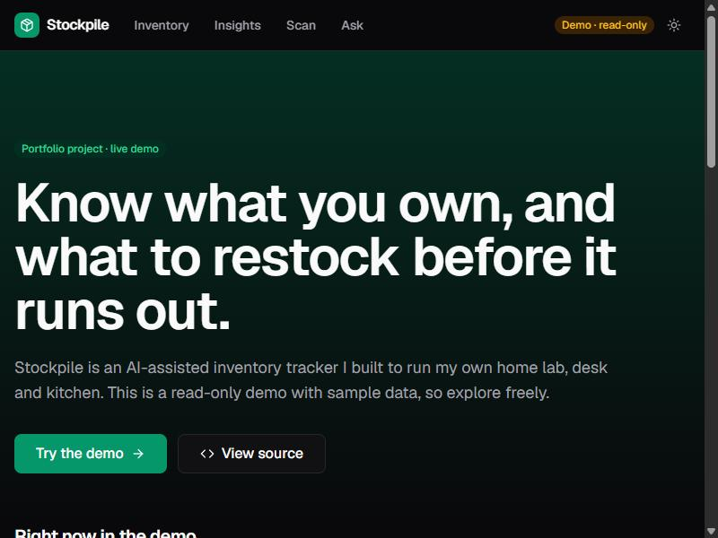
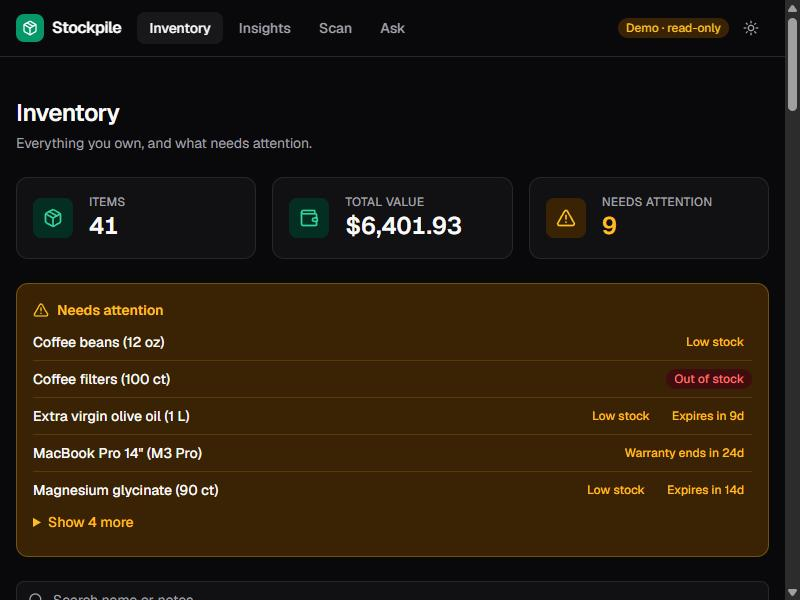
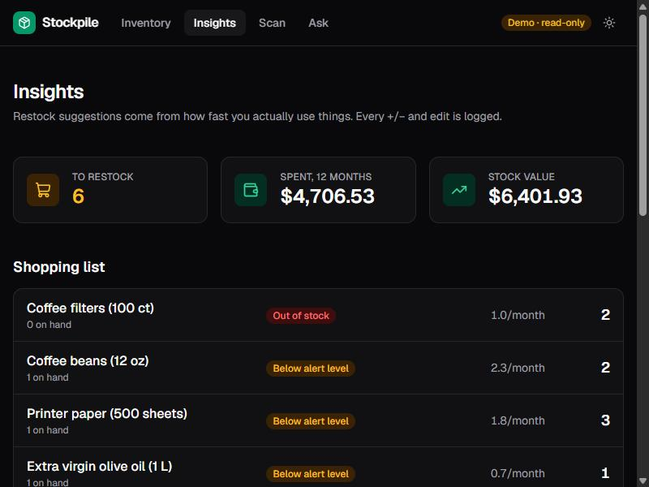
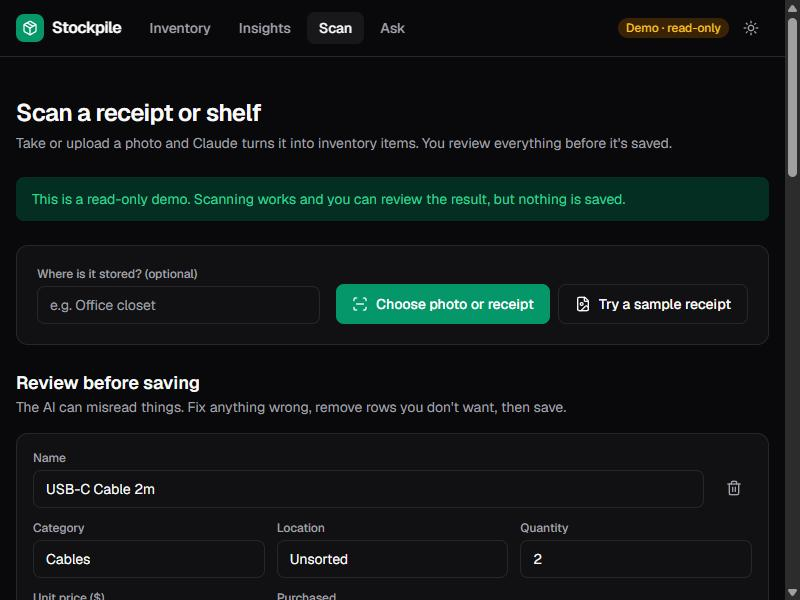
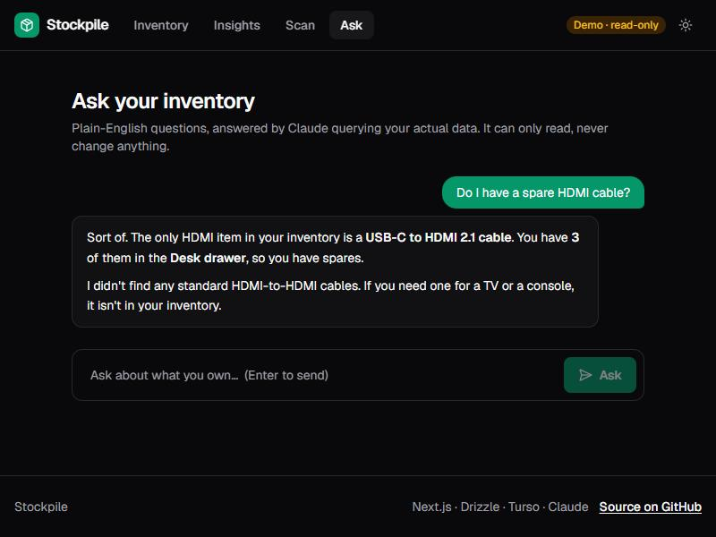
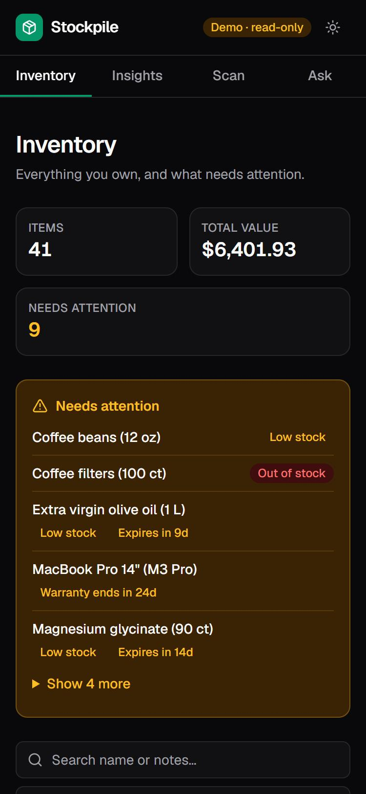

# Stockpile

[](https://github.com/Keepas3/Inventory-Tracker/actions/workflows/ci.yml)

An AI-assisted inventory tracker I built to run my own home lab, desk and kitchen. It tracks what I own, reads receipts with Claude, answers questions about my stuff in plain English, and predicts what I'll need to restock from how fast I actually use things.

**[Live demo →](https://inventory-tracker-two-sigma.vercel.app/)** (read-only, fictional sample data that refreshes daily; the AI features are live but rate-limited)



<table>
  <tr>
    <td width="50%"><br><sub><b>Inventory:</b> low stock, expiring items and warranties surface automatically.</sub></td>
    <td width="50%"><br><sub><b>Insights:</b> a shopping list driven by real usage rates.</sub></td>
  </tr>
  <tr>
    <td width="50%"><br><sub><b>Scan:</b> a photo becomes structured items you review before saving.</sub></td>
    <td width="50%"><br><sub><b>Ask:</b> answers come from read-only database queries, not guesses.</sub></td>
  </tr>
</table>

<p align="center"><br><sub>Designed for phones too: tab navigation, cards instead of a wide table.</sub></p>

## What it does

- **Scan:** upload a receipt or shelf photo. Claude (vision + structured output) turns it into items with quantities, prices and dates. Nothing is saved until you review and confirm, and every row is re-validated server-side.
- **Ask:** natural-language Q&A ("do I have a spare HDMI cable?"). The model can only *read*, through a few narrow query tools, so answers are grounded in the real database.
- **Restock predictions:** every +/− and edit is logged. Usage rates over a 90-day window project when each consumable runs out and how much to buy.
- **Alerts:** low/out of stock, expired or expiring items, warranties ending or lapsed.
- **Insights:** spend by month, stock value by category, and a weekly email digest (cron).

## Engineering highlights

- **Two deployment modes from one codebase.** `private` (password login) for real data, `demo` (public, read-only) for the portfolio. One tested policy function (`src/lib/access.ts`) drives both the proxy and the server code.
- **Defence in depth.** The proxy gates every route, but every Server Action and AI route re-checks access itself. I verified a hand-crafted server-action request is rejected in demo mode. Production with missing auth config returns 503 everywhere instead of falling open.
- **Controlled AI usage.** The API key never reaches the browser; uploads are type- and size-checked and downscaled client-side; per-visitor rate limits plus a global daily cap bound spend; item text is treated as data, not instructions; refusals and API errors become friendly messages.
- **A demo that stays true.** All demo dates derive from "now", and a daily cron atomically regenerates the dataset, so "expires in 9 days" is always correct. The cron is hard-gated to demo mode and can never touch real data.
- **Pure, tested business logic.** Alert rules, usage-rate and restock math, digest building, session tokens and the access policy are pure functions with unit tests (including the bug-catching kind: usage history must reconcile with quantity on hand, and the same alerts must regenerate months later).
- **Polished UX.** Light/dark theme with no flash, mobile-first layouts, pending states on every action, delete confirmation, toasts, skeleton loading, themed error and 404 pages, keyboard focus styles and ARIA wiring on forms.
- **CI on every push:** lint, typecheck, unit tests, production build and a dependency audit.

## Architecture

```
Browser ── Next.js App Router (React Server Components, Server Actions)
              │
              ├─ proxy.ts ──────────── optimistic auth gate (session cookie / demo mode)
              ├─ Server Actions ────── requireWriter() → zod validation → Drizzle ORM
              ├─ /api/ai/extract ───── Claude vision → structured output → candidate rows
              ├─ /api/ai/ask ───────── Claude + read-only tools → database queries
              └─ /api/cron/* ───────── weekly digest, daily demo refresh (bearer-secret)
                                        │
                                  libSQL / SQLite  (local file in dev, Turso in prod)
```

**Stack:** Next.js 16 · TypeScript · Tailwind CSS v4 · Drizzle ORM · libSQL/Turso · Zod · Claude API · Vitest · Vercel

## Security model

- **Sessions:** stateless HMAC-signed token in an httpOnly, SameSite=Lax, Secure cookie; constant-time password and signature comparison; login throttled to 5 attempts per 15 minutes; post-login redirects restricted to same-site paths.
- **Fails closed:** a typo'd `APP_MODE`, or a production build without auth config, locks the app instead of picking a mode.
- **Cron endpoints:** bearer-secret protected, constant-time compared, 401 without the secret. The destructive demo refresh additionally requires `APP_MODE=demo`.
- **Hardening:** security headers (nosniff, frame deny, HSTS, referrer and permissions policies), `npm audit` in CI, and a seed script that refuses to wipe a non-local database without explicit confirmation.

## Run locally

```bash
npm install
cp .env.example .env.local   # add ANTHROPIC_API_KEY for the AI features (optional)
npm run db:push              # create the SQLite schema (local.db)
npm run db:seed              # load the sample dataset
npm run dev                  # http://localhost:3000
```

Without an API key everything works except Scan and Ask, which show a notice. Locally the app is open (no login); set `AUTH_PASSWORD` and `SESSION_SECRET` to try private mode, or `APP_MODE=demo` to see the public demo.

| Script | Purpose |
|---|---|
| `npm test` | Vitest unit tests |
| `npm run typecheck` | `next typegen` + `tsc --noEmit` |
| `npm run lint` | ESLint |
| `npm run db:push` / `db:seed` | Create schema / reset to the sample dataset |

## Configuration

| Variable | Purpose |
|---|---|
| `ANTHROPIC_API_KEY` | Enables Scan and Ask (server-side only) |
| `APP_MODE` | `private` (default) or `demo` |
| `AUTH_PASSWORD`, `SESSION_SECRET` | Required in private mode (secret ≥ 32 chars) |
| `AI_DAILY_LIMIT` | Global cap on AI calls per day (default 300) |
| `CRON_SECRET` | Authorizes the cron endpoints |
| `DATABASE_URL`, `DATABASE_AUTH_TOKEN` | Turso/libSQL in production (defaults to `file:local.db`) |
| `RESEND_API_KEY`, `DIGEST_TO`, `DIGEST_FROM` | Optional email delivery for the weekly digest |
| `NEXT_PUBLIC_AUTHOR_NAME`, `NEXT_PUBLIC_PORTFOLIO_URL` | Optional "built by" credit in the footer |

Deployment (Vercel + Turso) is documented in [DEPLOY.md](DEPLOY.md).

## Trade-offs and what I'd do next

- **Rate limiting is in-memory,** so on serverless it is per-instance and resets on cold starts. It blunts abuse but the real spend ceiling is a workspace limit in the Anthropic console. A shared store (Redis/Upstash) would make it exact.
- **Schema changes use `drizzle-kit push`.** Fine for a solo project; versioned migrations would be the next step for a team.
- **Charts are plain CSS bars** (accessible, zero dependencies). A charting library would add interactivity if the data grew.
- **No browser end-to-end tests yet.** Logic is unit-tested and I verify UI flows by hand in a real browser; Playwright in CI is the obvious addition.
- **Single user.** Multi-user would add per-user data scoping on top of the existing auth.
